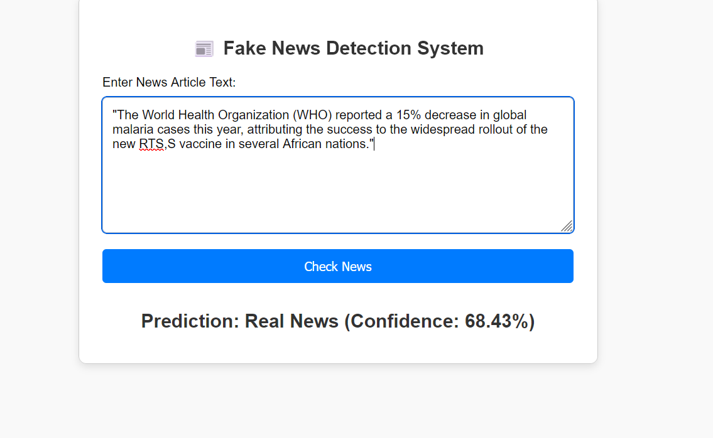

<p align="center">
  
</p>

<h1 align="center">🛡️ NewsGuard AI</h1>

<p align="center">
An AI-Powered Fake News Detection Web Application built using <b>Machine Learning</b>, <b>Natural Language Processing (NLP)</b>, and <b>Flask</b>.
</p>

<p align="center">


</p>

---

## 🌐 Live Demo

🔗 **Application:** https://newsguard-ai-pz3n.onrender.com/

---

# 📖 Project Overview

NewsGuard AI is a web-based Fake News Detection System developed as part of the **IBM PBEL Final Project**.

The application allows users to paste any news article into a text box and instantly predicts whether the news is **Real** or **Fake** using a Machine Learning model trained on a labeled news dataset.

The project combines **Natural Language Processing (NLP)** techniques with **Machine Learning** to preprocess textual data, extract meaningful features using TF-IDF Vectorization, and classify the news using a Logistic Regression model.

The application is developed using **Flask** for the backend and provides a clean, responsive user interface for real-time predictions.

---

# 🎯 Project Objectives

- Build a machine learning model to classify fake and real news.
- Apply NLP preprocessing techniques to clean textual data.
- Develop a user-friendly Flask web application.
- Deploy the application on Render for live access.
- Demonstrate practical implementation of Machine Learning in web applications.

---

# ✨ Features

- ✅ Fake News Detection using Machine Learning
- ✅ Natural Language Processing (NLP)
- ✅ Logistic Regression Classification
- ✅ TF-IDF Feature Extraction
- ✅ Real-Time News Prediction
- ✅ Confidence Score Display
- ✅ Responsive Web Interface
- ✅ Flask Backend
- ✅ Model Health Check Endpoint
- ✅ Deployed on Render

---

# 📑 Table of Contents

- Project Overview
- Features
- Screenshots
- Demo
- Project Structure
- Technologies Used
- Installation
- Usage
- API Endpoints
- Machine Learning Model
- Deployment
- Future Scope
- Author
- License

---

# 📸 Application Screenshots

## 🏠 Homepage

The homepage provides a clean and responsive interface where users can enter any news article for analysis.

<p align="center">
  
</p>

---

## 📝 News Prediction

Users can paste any news article into the input field and click the **Check News** button to analyze whether the news is genuine or fake.

<p align="center">
  
</p>

---

## ❌ Fake News Prediction

Example of the prediction result when the entered news is classified as **Fake**.

<p align="center">
  
</p>

---

## ✅ Real News Prediction

Example of the prediction result when the entered news is classified as **Real**.

<p align="center">
  
</p>

---

# 🎥 Project Demonstration

A short demonstration showing the complete workflow of the application.

<p align="center">
  
</p>

---

# 🛠️ Technologies Used

The following technologies and tools were used to develop this project.

| Technology | Purpose |
|------------|---------|
| Python | Programming Language |
| Flask | Backend Web Framework |
| HTML5 | Frontend Structure |
| CSS3 | Styling |
| JavaScript | Client-side Interactions |
| Scikit-learn | Machine Learning Model |
| Pandas | Data Manipulation |
| NumPy | Numerical Computing |
| Pickle | Model Serialization |
| Gunicorn | Production WSGI Server |
| Render | Cloud Deployment |
| Git & GitHub | Version Control |

---

# 📂 Project Structure

```text
NewsGuard-AI/
│
├── app.py
├── requirements.txt
├── Procfile
├── runtime.txt
├── README.md
├── .gitignore
│
├── utils/
│   └── prediction.py
│
├── model/
│   ├── model.pkl
│   └── vectorizer.pkl
│
├── templates/
│   └── index.html
│
├── static/
│   ├── css/
│   │   └── style.css
│   ├── js/
│   └── images/
│
├── assets/
│   ├── banner/
│   │   └── banner.png
│   ├── screenshots/
│   │   ├── homepage.png
│   │   ├── prediction.png
│   │   ├── fake-result.png
│   │   └── real-result.png
│   └── demo/
│       └── demo.gif
│
├── data/
│   ├── Fake.csv
│   └── True.csv
│
└── notebooks/
    └── FakeNewsDetectionUsingMachineLearning.ipynb
```

---

# ⚙️ Working of the Application

The application follows the workflow shown below.

```
User Inputs News
        │
        ▼
Text Preprocessing
        │
        ▼
TF-IDF Vectorization
        │
        ▼
Logistic Regression Model
        │
        ▼
Prediction
        │
        ▼
Display Result on Web Page
```

---

# 🚀 Installation

Follow the steps below to set up and run the project on your local machine.

## Prerequisites

Before starting, ensure that the following software is installed:

- Python 3.11 or later
- Git
- pip (Python Package Manager)
- VS Code (Recommended)

---

## Step 1: Clone the Repository

```bash
git clone https://github.com/<your-github-username>/<your-repository-name>.git
```

Move into the project directory.

```bash
cd NewsGuard-AI
```

---

## Step 2: Create a Virtual Environment

### Windows

```bash
python -m venv venv
venv\Scripts\activate
```

### Linux / macOS

```bash
python3 -m venv venv
source venv/bin/activate
```

---

## Step 3: Install Required Packages

```bash
pip install -r requirements.txt
```

---

## Step 4: Run the Flask Application

```bash
python app.py
```

The application will start at:

```
http://127.0.0.1:5000
```

Open this URL in your browser.

---

# 💻 How to Use

Using the application is simple.

### Step 1

Open the homepage.

### Step 2

Paste a news article into the text box.

### Step 3

Click the **Check News** button.

### Step 4

The Machine Learning model processes the news.

### Step 5

The application displays

- News Classification
- Confidence Score

within a few seconds.

---

# 🌐 API Endpoints

The Flask application provides the following endpoints.

---

## Home Page

### GET /

Displays the homepage.

**Response**

```
HTML Page
```

---

## Prediction Endpoint

### POST /predict

Predicts whether the entered news is Fake or Real.

### Request

| Parameter | Type | Description |
|-----------|------|-------------|
| news_input | String | News article entered by the user |

### Response

The webpage displays:

- Prediction Result
- Confidence Score

---

## Health Check Endpoint

### GET /health

Used to verify whether the application and ML model are loaded successfully.

Example Response

```json
{
    "status": "healthy",
    "model_loaded": true
}
```

---

# 🧪 Testing the Application

The application can be tested using the following steps.

### Test Case 1

Input a genuine news article.

Expected Result

```
Prediction : REAL NEWS
```

---

### Test Case 2

Input fabricated or misleading news.

Expected Result

```
Prediction : FAKE NEWS
```

---

### Test Case 3

Leave the input box empty.

Expected Result

```
Please enter a valid news article.
```

---

### Test Case 4

Enter a very long news article.

Expected Result

```
Prediction generated successfully.
```

---

# 📌 Sample News for Testing

### Example of Real News

```
The Reserve Bank of India announced that the repo rate will remain unchanged after the latest Monetary Policy Committee meeting.
```

---

### Example of Fake News

```
Scientists confirm that drinking ten cups of coffee every day makes humans immortal according to NASA research.
```

The first article should generally be classified as **Real**, whereas the second should be classified as **Fake**.

---

# 📊 Performance Summary

| Feature | Status |
|----------|--------|
| Flask Backend | ✅ |
| Machine Learning Model | ✅ |
| TF-IDF Vectorizer | ✅ |
| Prediction System | ✅ |
| Confidence Score | ✅ |
| Responsive UI | ✅ |
| Render Deployment | ✅ |

---

# 🧠 Machine Learning Model

The Fake News Detection system uses a **Logistic Regression** classification model to determine whether a news article is **Real** or **Fake**.

Logistic Regression is a supervised machine learning algorithm widely used for binary classification problems. Since this project has only two classes (Real and Fake), it is an appropriate and efficient choice.

---

# ⚙️ Machine Learning Workflow

The prediction process follows the steps below:

```
News Article
      │
      ▼
Text Cleaning
      │
      ▼
Text Preprocessing
      │
      ▼
TF-IDF Vectorization
      │
      ▼
Logistic Regression Model
      │
      ▼
Prediction
      │
      ▼
Real News / Fake News
```

---

# 📊 Dataset Information

The model was trained using a publicly available Fake News dataset.

Dataset Files:

```
data/
├── Fake.csv
└── True.csv
```

The dataset contains thousands of labeled news articles belonging to two categories:

- Fake News
- Real News

The datasets were merged, shuffled, preprocessed, and then divided into training and testing sets before model training.

---

# 🧹 Text Preprocessing

Before making predictions, every news article undergoes several preprocessing steps to improve model performance.

The preprocessing pipeline includes:

- Convert text to lowercase
- Remove URLs
- Remove HTML tags
- Remove punctuation
- Remove numbers
- Remove extra spaces
- Remove newline characters

These preprocessing techniques help reduce noise in textual data and improve prediction accuracy.

---

# 🔠 TF-IDF Vectorization

Machine Learning models cannot directly understand textual data.

Therefore, the cleaned news article is converted into numerical features using **TF-IDF (Term Frequency – Inverse Document Frequency)**.

TF-IDF assigns higher importance to meaningful words while reducing the weight of commonly occurring words.

This numerical representation is then passed to the Logistic Regression model for classification.

---

# 🤖 Classification Algorithm

**Algorithm Used**

- Logistic Regression

### Why Logistic Regression?

- Simple and efficient
- Fast prediction
- Works well for binary classification
- Easy to interpret
- Suitable for NLP classification tasks

---

# 📈 Prediction Output

The application predicts one of the following classes:

| Prediction | Meaning |
|------------|---------|
| ✅ Real News | The article is likely genuine. |
| ❌ Fake News | The article is likely misleading or fabricated. |

Along with the prediction, the application also displays the **confidence score** generated by the model.

---

# 📦 Python Libraries Used

The project uses the following Python libraries:

| Library | Purpose |
|---------|---------|
| Flask | Web Framework |
| scikit-learn | Machine Learning |
| Pandas | Data Processing |
| NumPy | Numerical Operations |
| Pickle | Save & Load Model |
| Gunicorn | Production WSGI Server |

---

# 📁 Model Files

The trained Machine Learning model is stored inside the **model** directory.

```
model/
├── model.pkl
└── vectorizer.pkl
```

### model.pkl

Stores the trained Logistic Regression model.

### vectorizer.pkl

Stores the trained TF-IDF Vectorizer used during training.

These files are loaded automatically when the Flask application starts.

---

# 💡 Why This Model?

The selected model provides a good balance between:

- Prediction Accuracy
- Speed
- Simplicity
- Easy Deployment
- Low Resource Consumption

These characteristics make it suitable for an academic web application developed using Flask.

---

# ☁️ Deployment

The application has been successfully deployed on **Render**, making it accessible online without requiring local setup.

### 🌐 Live Application

**Live Demo:** https://newsguard-ai-pz3n.onrender.com/

### Deployment Platform

- Render
- Gunicorn (WSGI Server)
- Flask

The deployment was configured using the following files:

```
requirements.txt
Procfile
runtime.txt
```

---

# 🧪 Testing

The application was tested using multiple types of news articles.

| Test Case | Expected Result | Status |
|-----------|-----------------|--------|
| Real News | Classified as Real | ✅ Passed |
| Fake News | Classified as Fake | ✅ Passed |
| Empty Input | Validation Message | ✅ Passed |
| Long News Article | Prediction Generated | ✅ Passed |

The deployed application was also tested successfully after deployment on Render.

---

# 🚨 Troubleshooting

### Model Not Loading

- Verify that `model.pkl` and `vectorizer.pkl` are available inside the `model/` folder.
- Ensure the correct file paths are used in the application.

---

### Missing Python Packages

Install all required dependencies:

```bash
pip install -r requirements.txt
```

---

### Flask Application Not Starting

Check whether the virtual environment is activated.

Then run:

```bash
python app.py
```

---

### Deployment Issues

If deployment fails:

- Verify `requirements.txt`
- Check `Procfile`
- Confirm the Python version
- Review deployment logs on Render

---

# 🚀 Future Scope

The current application successfully detects fake news using Machine Learning. Future improvements may include:

- Improve prediction accuracy using advanced models.
- Support multiple languages.
- Detect fake news directly from URLs.
- Add user authentication.
- Maintain prediction history.
- Integrate fact-checking APIs.
- Train using larger and more recent datasets.
- Deploy as a mobile application.

---

# 📚 Learning Outcomes

This project helped in understanding:

- Machine Learning workflow
- Natural Language Processing (NLP)
- Text preprocessing techniques
- TF-IDF Vectorization
- Logistic Regression Classification
- Flask Web Development
- Model Deployment using Render
- Git and GitHub workflow


---

# 👨‍💻 Author

**Shubham Maurya**

B.Tech in Computer Science and Engineering

IBM PBEL Final Project

---

# 🙏 Acknowledgements

Special thanks to:

- IBM PBEL Internship Program
- Flask Documentation
- Scikit-learn Documentation
- Kaggle Fake News Dataset
- Render Platform

---

# 📄 License

This project has been developed for **educational and learning purposes** as part of the **IBM PBEL Final Project**.

Feel free to explore and learn from the implementation.

---

# ⭐ If You Like This Project

If you found this project useful, consider giving it a ⭐ on GitHub.

It helps others discover the project and motivates future improvements.


