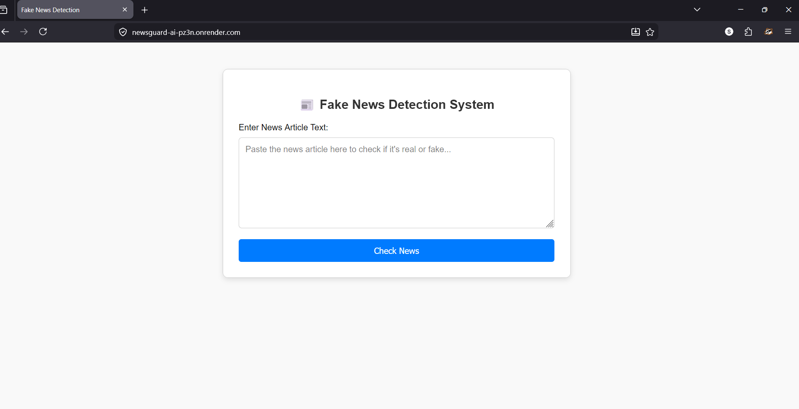
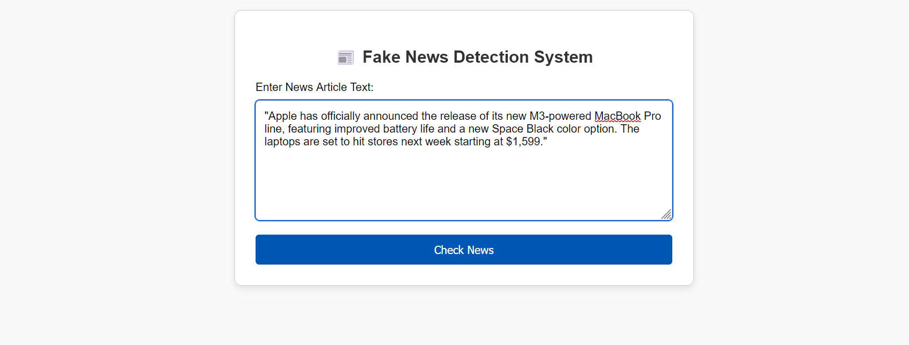
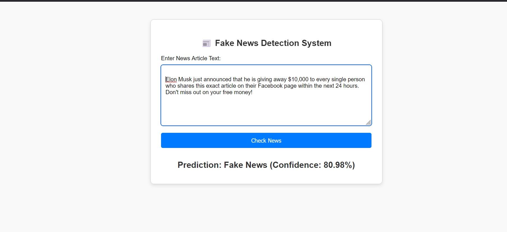

# Fake News Detection Using Machine Learning

A Flask-based web application that uses machine learning to detect whether news articles are real or fake.

## Features

- **Machine Learning Powered**: Uses Logistic Regression model trained on news text data
- **Text Preprocessing**: Advanced text cleaning including URL removal, HTML tag removal, punctuation removal
- **Real-time Prediction**: Instant classification of news articles as "Real" or "Fake"
- **Confidence Scores**: Provides confidence percentage for each prediction
- **Responsive UI**: Clean, user-friendly web interface
- **Health Monitoring**: Built-in health check endpoint for monitoring
- **Production Ready**: Configured for deployment with Gunicorn

## Project Structure

```
Fake_News_Detection_Using_Machine_learning/
├── app.py                      # Main Flask application
├── utils/
│   └── prediction.py           # Text preprocessing and prediction utilities
├── model/
│   ├── model.pkl               # Trained Logistic Regression model
│   └── vectorizer.pkl          # TF-IDF vectorizer
├── templates/
│   └── index.html              # Main HTML template
├── static/
│   ├── css/
│   │   └── style.css           # Stylesheet
│   ├── js/                     # JavaScript files (if needed)
│   └── images/                 # Image assets (if needed)
├── data/
│   ├── Fake.csv                # Fake news dataset
│   └── True.csv                # Real news dataset
├── notebooks/
│   └── FakeNewsDetectionUsingMachineLearing.ipynb  # ML training notebook
├── requirements.txt            # Python dependencies
├── Procfile                    # Heroku deployment configuration
├── runtime.txt                 # Python runtime version
├── .gitignore                  # Git ignore rules
└── README.md                   # This file
```
# Homepage



## Prediction



## Fake News



## Banner


## Demo GIF


## Installation

### Prerequisites

- Python 3.8 or higher
- pip package manager
- Virtual environment (recommended)

### Setup Instructions

1. **Clone the repository**
   ```bash
   git clone <repository-url>
   cd Fake_News_Detection_Using_Machine_learning
   ```

2. **Create and activate virtual environment**
   ```bash
   # Windows
   python -m venv myenv
   myenv\Scripts\activate

   # Linux/Mac
   python3 -m venv myenv
   source myenv/bin/activate
   ```

3. **Install dependencies**
   ```bash
   pip install -r requirements.txt
   ```

4. **Run the application**
   ```bash
   python app.py
   ```

5. **Access the application**
   - Open browser and navigate to: `http://localhost:5000`

## Usage

1. Open the web application in your browser
2. Paste a news article text into the text area (minimum 50 characters)
3. Click "Check News" button
4. View the prediction result with confidence score

## API Endpoints

### GET /
- **Description**: Renders the home page with prediction form
- **Response**: HTML page

### POST /predict
- **Description**: Predicts whether news is real or fake
- **Request Parameters**:
  - `news_input` (string): The news article text to analyze
- **Response**: HTML page with prediction result
- **Errors**:
  - 400: Invalid or missing input
  - 500: Server error during prediction

### GET /health
- **Description**: Health check endpoint for monitoring
- **Response**: JSON with status
  ```json
  {
    "status": "healthy",
    "model_loaded": true
  }
  ```

## Model Details

- **Algorithm**: Logistic Regression
- **Features**: TF-IDF (Term Frequency-Inverse Document Frequency)
- **Training Data**: Combined dataset of real and fake news articles
- **Preprocessing**:
  - Lowercase conversion
  - URL removal
  - HTML tag removal
  - Punctuation removal
  - Digit removal
  - Newline character removal

## Dependencies

- **Flask 3.0.0**: Web framework
- **scikit-learn 1.3.1**: Machine learning library
- **numpy < 2.0.0**: Numerical computing
- **pandas 2.1.1**: Data manipulation
- **gunicorn 21.2.0**: WSGI HTTP Server (production)

## Deployment

### Heroku Deployment

1. Ensure all files are committed to Git
2. Create a Heroku app:
   ```bash
   heroku create your-app-name
   ```
3. Push to Heroku:
   ```bash
   git push heroku main
   ```

### Other Platforms

The application can be deployed to any platform that supports:
- Python 3.11.7
- Gunicorn WSGI server
- Flask applications

Update the `Procfile` and `runtime.txt` as needed for your platform.

## Development

### Running in Development Mode

```bash
# Set Flask environment variables
set FLASK_APP=app.py
set FLASK_ENV=development

# Run with auto-reload
flask run
```

### Adding New Features

1. **New preprocessing steps**: Add to `TextPreprocessor` class in `utils/prediction.py`
2. **New routes**: Add to `app.py` or create separate route modules
3. **Model updates**: Replace `.pkl` files in `model/` directory

## Testing

To test the application:

1. Start the Flask server
2. Navigate to `http://localhost:5000`
3. Test with sample news articles:
   - Real news: Paste a legitimate news article
   - Fake news: Paste fabricated or satirical content

## Troubleshooting

### Model Loading Errors
- Ensure `model/model.pkl` and `model/vectorizer.pkl` exist
- Check file permissions
- Verify pickle files are not corrupted

### Import Errors
- Activate virtual environment
- Reinstall dependencies: `pip install -r requirements.txt`

### Port Already in Use
- Change port in `app.py`: `app.run(port=5001)`
- Or stop the process using port 5000

## Security Considerations

- **Secret Key**: Change `app.secret_key` in production
- **Model Files**: Keep `.pkl` files secure (pickle can execute arbitrary code)
- **Input Validation**: Application validates input length and content
- **Error Handling**: Errors are logged but not exposed to users

## Performance

- Model loading is lazy (only when first request is made)
- Gunicorn with 4 workers for concurrent request handling
- TF-IDF vectorization for efficient text feature extraction

## License

This project is created for educational purposes as part of an internship project.

## Author

Shubham Maurya

## Acknowledgments

- Dataset: Kaggle Fake News dataset
- Built with Flask and scikit-learn
